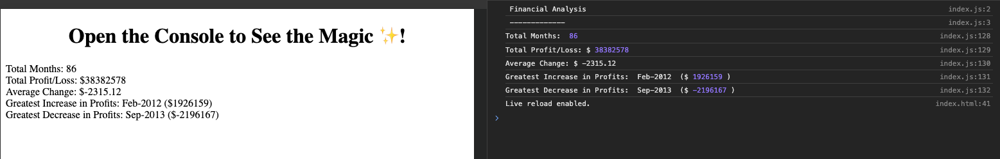

# Console Finances Assignment

This repository was created for the Javascript Challenge

# Description

The task was to calculate the total number of months, the net total amount of Profit/Losses over the entire period and the average of the changes in Profit/Losses over the entire period using Javascript from the dataset that was provided.

My solution in the screenshot below shows my results printed in the browser using HTML and in the developer console.

# Technologies Used

All code was done using Microsoft's Visual Studio Code Editor (VS Code).

# License

[MIT](https://choosealicense.com/licenses/mit/)
